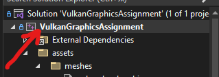

# Вулканическая графика
## Как настроить себе все
<h3> Внимание, это работает только на x64, хз как там у остальных </h3>
 
Итак, для начала вам понадобится установить себе некоторые библиотеки, а именно 
<ul>
    <li>GLFW https://www.glfw.org/download - создание окна вам нужны скомпилированные бинарники </li>
    <li>glm https://github.com/g-truc/glm.git - мотематика</li>
    <li>VulkanSDK https://vulkan.lunarg.com/ - Вулкан(графический API) качаем с инстоллера </li>
    <li>tinyobjloader https://github.com/tinyobjloader/tinyobjloader.git - однофайловая ютилити для загрузки моделей</li>
    <li>stb https://github.com/nothings/stb.git - однофайловая ютилити для загрузки текстур из картинок(png)</li>
</ul>

 

Когда вы все это скачали нужно это все подключить. Я делаю в Visual studio, вы хз как будете, если через CMake гуд лак, я не такой умный.

Создаем проект с терминалом(который обычно делаем).

 
Шаг 1.

 В Visual studio нажимаем на проект, затем либо 'Alt + enter' либо пкм и в самый низ. 

  

 
Шаг 2.

 В основном разделе меняем версию плюсов на последнюю (я выбрал 2020, хотя, конечно, есть еще незаконченная 2023). 

 
Шаг 3.

 В разделе основное добавляем все вышеперечисленные библиотеки. (у вас, естественно будут другие пути) 

<ul> 
<li>C:\VulkanSDK\1.3.250.0\Include</li>
<li>D:\dev\includes\glm</li>
<li>D:\dev\includes\glfw-3.3.8.bin.WIN64\include</li>
<li>D:\dev\vendor\tinyobjloader</li>
<li>D:\dev\vendor\stb</li>
</ul>

 
Шаг 4.

 В разделе линковщика, основное, добавляем двa пути к либам. 

<ul> 
<li>D:\dev\includes\glfw-3.3.8.bin.WIN64\lib-vc2022</li>
<li>C:\VulkanSDK\1.3.250.0\Lib</li>
</ul>

 
Шаг 5.

 В разделе линковщика, основное, добавляем непосредственно сами эти библиотеки. 

<ul> 
<li>vulkan-1.lib</li>
<li>glfw3.lib</li>
</ul>

 
Шаг 6.

 Наконец в разделе с Build events добавляем фигню чтобы каждый раз при билде перекомпилировались шейдеры. 

## Что прикольного можно менять
Можно менять очень легко проекцию, например. Просто при создании камеры поставить setPerspectiveProjection/setOrthographicProjection. Остальное придумывайте сами, я не знаю что можно поменять настолько же просто.
